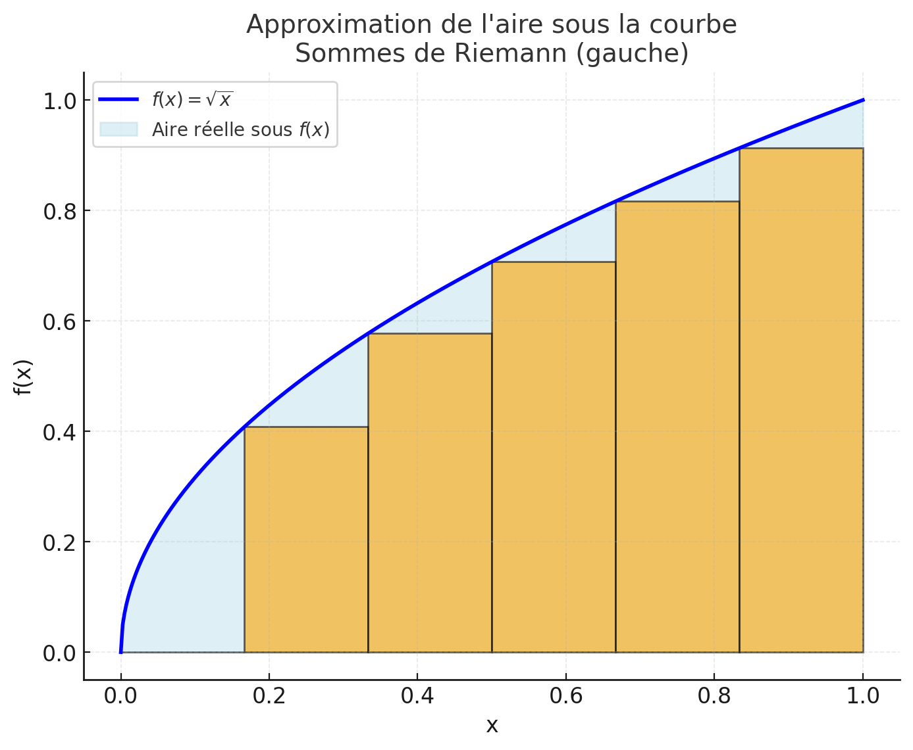
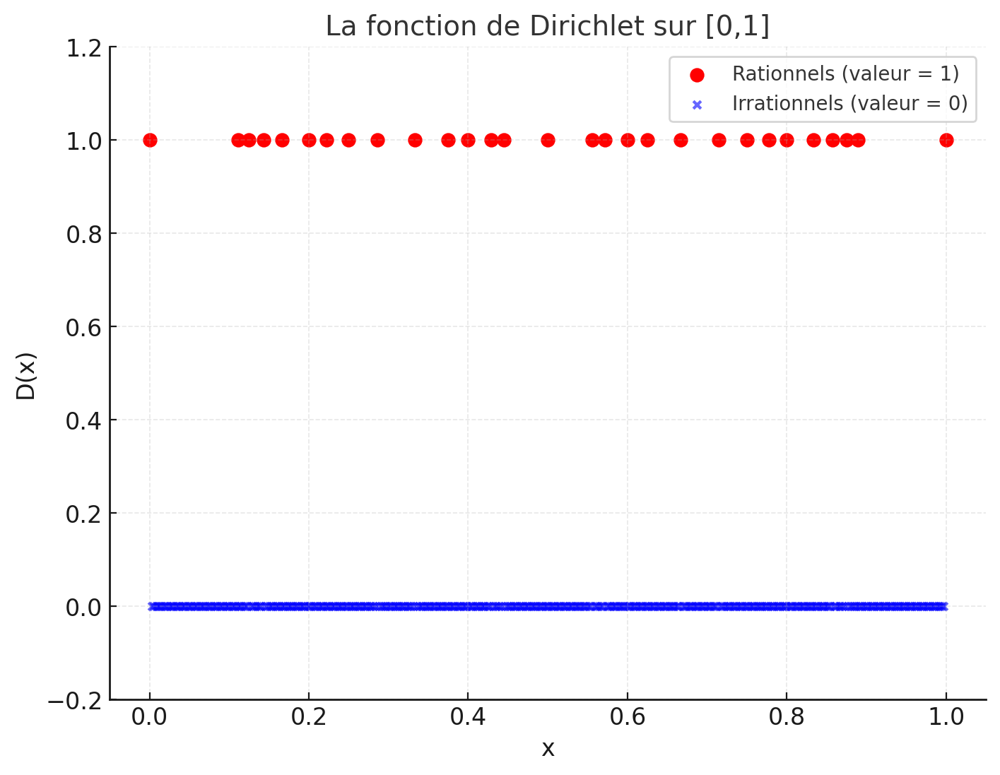
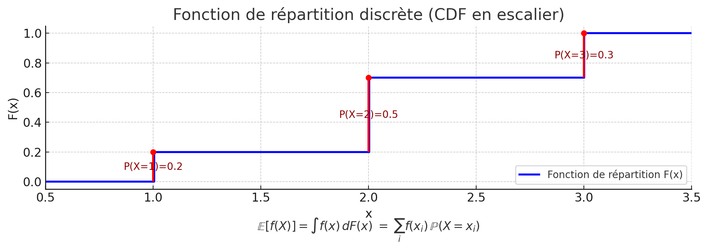
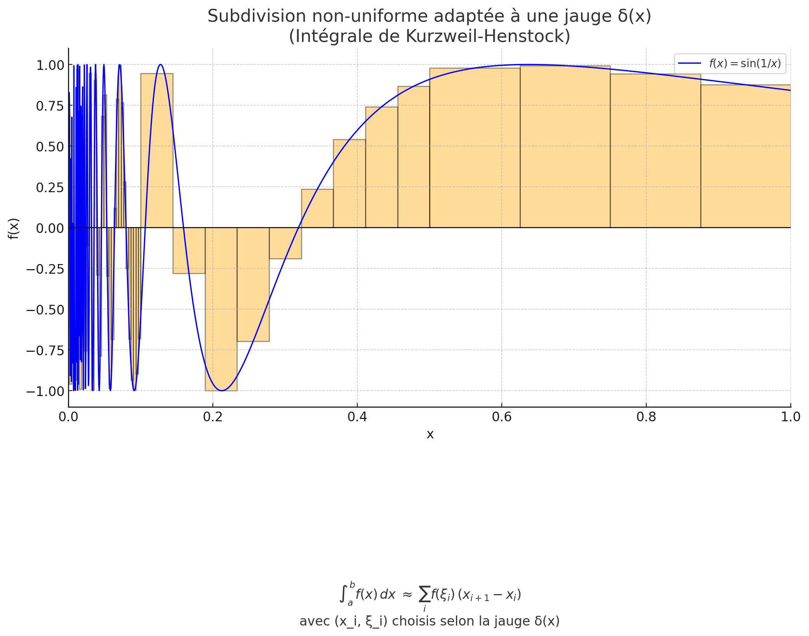

# 🌌 L'Odyssée de l'Intégration : Au-delà de l'Aire sous la Courbe

## Prologue : La Quête d'un Outil Parfait

Toute personne ayant touché aux mathématiques connaît l'intégrale. Dans sa forme la plus pure, celle imaginée par **Bernhard Riemann**, c'est une idée d'une beauté et d'une intuition saisissantes : l'aire sous une courbe. On la visualise, on la "sent". On découpe la base en une myriade de rectangles infiniment fins, on somme leurs aires, et la magie opère. 📏

Pourtant, cet outil si élégant, si fondamental, est aussi fragile. Face à des fonctions trop "sauvages", trop discontinues, l'édifice de Riemann s'effondre. Les sommes n'arrivent plus à se mettre d'accord, et le concept d'aire perd son sens. Illustrons concrètement cette défaillance avec un célèbre "monstre" mathématique : la **fonction de Dirichlet**, définie sur l'intervalle $[0,1]$. Son comportement est le chaos incarné :

$$
D(x) =
\begin{cases}
1 & \text{si } x \text{ est un nombre rationnel}, \\
0 & \text{si } x \text{ est un nombre irrationnel}.
\end{cases}
$$

Imaginez un peigne aux dents infiniment denses. Entre deux dents (deux nombres rationnels), il y a toujours une infinité de "trous" (des irrationnels), et entre deux trous, une infinité de dents. C'est l'image de cette fonction.

Pourquoi l'intégrale de Riemann reste-t-elle indécise face à elle ? Rappelons que Riemann nous demande de découper l'intervalle $[0,1]$ en petits segments et, sur chacun, de choisir un point pour dessiner un rectangle.

- **L'approche optimiste (Somme supérieure de Darboux)** : sur chaque petit segment, aussi minuscule soit-il, on peut toujours trouver un nombre rationnel. Si l'on choisit systématiquement ce point, la hauteur de notre rectangle sera toujours de 1. En sommant toutes les aires, on obtient une aire totale de 1.
- **L'approche pessimiste (Somme inférieure de Darboux)** : de même, sur chaque petit segment, on peut toujours trouver un nombre irrationnel. Si l'on est pessimiste et que l'on choisit ce point, la hauteur du rectangle sera toujours 0. L'aire totale est alors de 0.

Le verdict de Riemann dépend de la finesse de la subdivision. Mais ici, peu importe à quel point nos rectangles sont fins, l'optimiste trouvera toujours 1 et le pessimiste 0. Les deux estimations ne se réconcilient **jamais**. L'intégrale de Riemann n'est pas définie. C'est cette fragilité qui a lancé une quête de près de 150 ans, une véritable odyssée intellectuelle pour forger un concept d'intégration plus général, plus robuste, plus puissant.

Ce voyage nous mènera à déconstruire notre intuition, à "atterrir" dans des mondes mathématiques où les règles changent, et à "cultiver le paradoxe" d'outils qui gagnent en puissance ce qu'ils perdent en simplicité. Embarquez pour une exploration des grandes théories de l'intégration, des piliers classiques jusqu'aux frontières de la recherche.

---

## Chapitre I : Les Piliers Classiques et Leurs Fissures 🏛️

### L'Édifice de Lebesgue : Mesurer l'Espace avec une Nouvelle Perspective

📜 Contexte historique : Nous somme en 1902...

Face à l'échec de Riemann sur la fonction de Dirichlet, **Henri Lebesgue** propose au début du XXe siècle une approche radicalement différente. Il abandonne l'idée de découper le domaine de définition (l'axe des $x$) pour s'attaquer directement au problème sous un autre angle : découper l'ensemble d'arrivée (l'axe des $y$).

---

**Comparons les deux approches pour calculer l'aire :**

- **Approche de Riemann :** on fixe des largeurs $\Delta x_i$ et on somme des hauteurs variables

$$
\text{Aire} \approx \sum_i \underbrace{f(x_i)}_{\text{hauteur variable}} \cdot \underbrace{\Delta x_i}_{\text{largeur fixe}}
$$

- **Approche de Lebesgue :** on fixe des hauteurs $y_j$ et on somme des largeurs variables

$$
\text{Aire} \approx \sum_j \underbrace{y_j}_{\text{hauteur fixe}} \cdot \underbrace{\mu\{x \mid f(x) \approx y_j\}}_{\text{largeur variable}}
$$

---

Soudain, le problème se déplace. La difficulté n'est plus d'évaluer la fonction en des points, mais de déterminer la "largeur totale" ou la "taille" de l'ensemble des antécédents pour une hauteur donnée. Pour la fonction de Dirichlet, par exemple :

- La hauteur $y=1$ correspond à l'ensemble de tous les rationnels, $Q \cap [0,1]$.
- La hauteur $y=0$ correspond à l'ensemble de tous les irrationnels, $(\mathbb{R}\setminus Q) \cap [0,1]$.

Pour donner un sens à la somme $\sum_j y_j \cdot \text{taille} (x \mid f(x) \approx y_j)$, Lebesgue a dû inventer un outil capable de mesurer la "taille" d'ensembles bien plus complexes que de simples intervalles. Cet outil, c'est la **Théorie de la Mesure**.

- **L'Outil Clé : La Théorie de la Mesure.** Lebesgue dote les mathématiques d'un concept de "longueur généralisée", ou **mesure**, notée $\mu$. La mesure de l'ensemble des rationnels est $\mu(\mathbb{Q})=0$, tandis que celle des irrationnels sur $[0,1]$ est $\mu([0,1]\setminus\mathbb{Q})=1$.

L'intégrale de Dirichlet devient alors évidente. Rappelons aussi la condition générale : une fonction mesurable $f$ est Lebesgue-intégrable si et seulement si

$$
\int |f(x)| \, d\mu(x) < \infty.
$$

Et donc :

$$
\int_0^1 D(x) \, dx 
= 1 \cdot \mu(\mathbb{Q} \cap [0,1]) 
+ 0 \cdot \mu((\mathbb{R}\setminus\mathbb{Q}) \cap [0,1]) 
= 0
$$

---

### 📉 La Fissure dans l'Armure : Le Problème de la Semi-Convergence

Aussi puissant soit-il, l'édifice de Lebesgue a une règle d'or, une condition non négociable : une fonction $f$ n'est jugée "intégrable" que si l'intégrale de sa valeur absolue est finie.
C'est le critère d'**absolue intégrabilité** :

$$
\int |f(x)| \, dx < \infty.
$$

C'est ici que surgit notre premier grand défi, une fonction d'apparence simple mais redoutable, le **sinus cardinal** :

$$
f(x) = \frac{\sin(x)}{x}
$$

L'intégrale impropre au sens de Riemann

$$
\int_0^\infty \frac{\sin x}{x} \, dx
$$

converge. On peut le voir comme une série alternée : les aires des arches positives et négatives s'annulent progressivement, et la limite existe (elle vaut $\pi/2$).

**Mais pour Lebesgue, le test est fatal. Riemann accepte la convergence conditionnelle, tandis que Lebesgue exige la convergence absolue.
On doit examiner l'intégrale de la valeur absolue :**

$$
\int_0^\infty \left| \frac{\sin x}{x} \right| dx
$$

Cette intégrale **diverge**. Les arches, bien que de plus en plus petites, ne s'amenuisent pas assez vite. Leur somme est infinie, à l'image de la série harmonique $\sum \tfrac{1}{n}$. La fonction n'est donc **pas Lebesgue-intégrable**.

> Cela soulève un apparent paradoxe : comment une fonction peut-elle être Riemann-intégrable mais pas Lebesgue-intégrable, alors qu'un théorème affirme que toute fonction Riemann-intégrable est Lebesgue-intégrable ?
> La réponse est dans les détails : le théorème ne s'applique que sur les intervalles fermés et bornés $[a,b]$. Sur un tel intervalle, $\sin(x)/x$ est parfaitement intégrable aux deux sens. Mais sur le domaine infini $[0,\infty)$, les définitions divergent : Riemann utilise une limite, tandis que Lebesgue exige l'intégrabilité absolue sur tout le domaine.

Cette fissure nous a ouvert deux voies d'exploration pour aller plus loin.

## Chapitre II : Première Voie - La Flexibilité de la Mesure (Lebesgue-Stieltjes) 🎲

La première voie pour généraliser Lebesgue consiste à ne pas changer la méthode, mais à changer l'outil de mesure lui-même.

### L'Intégrale de Lebesgue-Stieltjes : La Règle à Graduer Personnalisée

L'idée de Thomas Stieltjes est de mesurer les longueurs sur l'axe des abscisses non pas avec une règle standard (qui correspond à la mesure $dx$), mais avec une "règle" déformable, personnalisée, définie par une autre fonction, disons $g(x)$. On n'intègre plus "par rapport à $x$", mais "par rapport à $g(x)$" :

$$
\int f(x)\, \mathrm{d}g(x)
$$

C'est une fusion de la puissante machinerie de Lebesgue avec l'idée de Stieltjes, permettant d'intégrer en pondérant différemment les régions de l'espace.

### L'Application Reine : L'Unification du Monde des Probabilités

Cet outil trouve son plein potentiel en théorie des probabilités. Il met fin à la schizophrénie entre :

- Les variables aléatoires discrètes (un lancer de dé), dont l'espérance est une somme : $\mathbb{E}[X]=\sum_i x_i\,\mathbb{P}(X=x_i)$.
- Les variables aléatoires continues (une loi Normale), dont l'espérance est une intégrale : $\mathbb{E}[X]=\int x\,p(x)\,dx$.

En intégrant par rapport à la fonction de répartition (CDF) $F(x)=\mathbb{P}(X\le x)$, on obtient une formule universelle pour l'espérance de $f(X)$ :

$$
\mathbb{E}[f(X)] \;=\; \int_{-\infty}^{\infty} f(x)\, \mathrm{d}F(x)
$$

La magie opère ici :

- Si $X$ est continue, $F(x)$ est une courbe lisse, et l’on peut montrer que $\mathrm{d}F(x)$ devient $p(x)\,dx$ (où $p$ est la densité de probabilité) : on retrouve une intégrale de Lebesgue classique.
- Si $X$ est discrète, $F(x)$ est une fonction en escalier. L'intégrale $\mathrm{d}F(x)$ "détecte" les sauts de l'escalier, et l'intégrale se transforme automatiquement en une somme pondérée par la hauteur des sauts, qui sont précisément les probabilités $\mathbb{P}(X=x_i)$ !

Toutefois cette intégrale est en essence, un cas particulier de la théorie plus générale de Lebesgue où l'on choisit une mesure $\mu$ qui n'est pas forcément la mesure de longueur standard (mesure Lebesgue classique). Dans cette vision plus générale, on s'autorise à prendre d'autre mesure comme celle de comptage dans le cas discret, percevant ainsi une somme comme une intégrale. L-S est ainsi le cas où cette mesure peut être construite à partir d'une fonction $g$. Ces mesures "constructibles" sont des exemples de mesures de Radon (ou mesures "gentilles"), qui sont bien comportées : finies sur les compacts et régulières.

## Chapitre III : Seconde Voie - Le Triomphe Subtil de Riemann (Kurzweil-Henstock) 🏆

La seconde voie est plus radicale et d'une subtilité folle. Elle ne part pas de Lebesgue, mais revient à la définition originelle de Riemann pour la réparer avec une modification minuscule aux conséquences gigantesques.

### L'Idée de Génie : La Jauge 🎯

📜 Contexte historique : Nous somme dans les années 1950-60 ; Jaroslav Kurzweil et Ralph Henstock repensèrent Riemann. Leur but : élargir l’intégration sans perdre le lien avec le Théorème Fondamental du Calcul.

Le défaut de Riemann était sa subdivision uniforme : la largeur de tous les rectangles devait être inférieure à un même $\delta$. Jaroslav Kurzweil et Ralph Henstock introduisent la jauge : une fonction $\delta(x)>0$ qui prescrit une tolérance **locale**, adaptée à chaque point $x$.

Près d'un point "difficile" où la fonction oscille beaucoup, on exige des rectangles très fins (on choisit un petit $\delta(x)$). Là où la fonction est sage et plate, on peut se permettre des rectangles larges (un grand $\delta(x)$).

Cette seule modification donne une intégrale, l'intégrale de Kurzweil-Henstock (K-H), aux propriétés extraordinaires.

**Exemple concret :** Pour une fonction oscillante comme $f(x) = \sin(1/x)$ sur $(0,1]$, on peut définir une jauge $\delta(x)$ qui impose des subdivisions extrêmement fines près de $0$ (par exemple $\delta(x)=x^2$), afin de capturer l’oscillation rapide. Plus loin de $0$, la jauge peut être beaucoup plus large.

### Les Trois Triomphes de K-H

#### 1. Dompter la Discontinuité Totale : Le Cas Dirichlet

La fonction de Dirichlet (1 sur les rationnels $Q$, 0 sur les irrationnels) est le cauchemar de Riemann. Pour K-H, son intégrale sur $[0,1]$ est trivialement **0**.

**La Stratégie :** On construit une jauge "intelligente" qui neutralise l'influence des points rationnels. L'ensemble $Q$ est dénombrable, on peut donc lister ses membres : $q_1,q_2,q_3,\ldots$

**La Jauge :** Pour un $\varepsilon>0$ arbitrairement petit, on définit la jauge $\delta(x)$ :

- Si $x=q_k$ est un rationnel, on impose une tolérance minuscule : $\delta(q_k) < \dfrac{\varepsilon}{2^{k+1}}$.
- Si $x$ est irrationnel, on est généreux : $\delta(x)=1$.

**Le Résultat :** Toute somme de Riemann qui respecte cette jauge est forcée d'utiliser des intervalles extrêmement petits autour des rationnels. La contribution totale de tous les points rationnels (où la fonction vaut $1$) est alors inférieure à

$$
\sum_{k=1}^{\infty} \frac{\varepsilon}{2^k} \;=\; \varepsilon.
$$

Comme ceci est vrai pour tout $\varepsilon$, l'intégrale est nulle.

#### 2. Résoudre le Cas $\sin(x)/x$ : L'Intégrale Impropre devient Propre

La fonction $x\mapsto \dfrac{\sin(x)}{x}$ est K-H intégrable sur $[0,\infty)$. L'intégrale n'est plus vue comme une limite, mais est définie directement. Son calcul repose sur la version K-H du **Théorème de Fubini**, qui autorise l'interversion d'intégrales sans la condition d'intégrabilité absolue de Lebesgue.

**Le Calcul :**

$$
\int_0^\infty \frac{\sin x}{x}\, dx
= \int_0^\infty \sin(x)\left(\int_0^\infty e^{-xy}\, dy\right) dx.
$$

L'interversion des intégrales, justifiée par le théorème de Fubini version K-H, donne :

$$
\int_0^\infty \left(\int_0^\infty \sin(x)\, e^{-xy}\, dx\right) dy
= \int_0^\infty \frac{1}{y^2+1}\, dy
= [\arctan(y)]_0^\infty
= \frac{\pi}{2}.
$$

Le **Théorème de Hake** solidifie ce résultat en montrant que l'intégrale K-H sur un intervalle infini $[a,\infty)$ coïncide toujours avec la limite des intégrales sur $[a,b]$ quand $b\to\infty$.

#### 3. Ressusciter le Théorème Fondamental du Calcul

C'est peut-être son plus grand succès. Pour K-H, le théorème est d'une pureté et d'une généralité absolues :

> Si $F'(x)=f(x)$ existe *partout* sur $[a,b]$, alors $f$ est K-H intégrable et
>
> $$
> \int_a^b f(x)\, dx \;=\; F(b)-F(a).
> $$

Ce théorème s'applique même à des fonctions pathologiques comme la **dérivée de Volterra**. On peut construire une fonction $F(x)$ dérivable partout, dont la dérivée $f(x)=F'(x)$ est bornée mais n'est **ni Riemann-intégrable, ni Lebesgue-intégrable**. Une telle fonction peut être construite sur un **ensemble de Cantor "gras"** (un ensemble de type Cantor mais de mesure non nulle). Seule K-H redonne son plein pouvoir au lien entre dérivation et intégration.

#### ⚠️ Mais alors ...

Aussi puissant soit-il, l’intégrale de Kurzweil–Henstock (K-H) révèle une faiblesse.

En effet, l’espace des fonctions intégrables au sens de K-H **n’est pas complet** : une suite de fonctions K-H intégrables, convergeant (au sens naturel de la norme $L^1$), peut avoir une limite qui **n’est plus K-H intégrable**. Autrement dit, il n’existe pas de véritable **espace $L^p$** associé à K-H.

On perd alors toute l’architecture fonctionnelle qui fait la force de Lebesgue :

- les espaces $L^1, L^2, \dots, L^p$ bien définis et complets,
- les théorèmes puissants de convergence (Fatou, convergence dominée, monotone),
- les fondements de l’Analyse de Fourier et des probabilités modernes.

K-H brille par sa souplesse pour rétablir le lien **dérivée–intégrale**, mais il ne fournit pas l’édifice fonctionnel et probabiliste bâti sur la complétude.
C’est là que l’intégrale de Lebesgue reprend l’avantage et devient l’outil incontournable.

## Chapitre IV : La Confrontation des Titans - Feuille de Route pour le Praticien 🧭

Face à ces théories, une question pragmatique se pose : quand utiliser quoi ?

### Tableau 1

| **Type de Problème**                                         | **Riemann** | **Lebesgue**                              | **Lebesgue-Stieltjes** | **Kurzweil-Henstock** | **Intuition**              |
| ------------------------------------------------------------------- | ----------------- | ----------------------------------------------- | ---------------------------- | --------------------------- | -------------------------------- |
| Fonctions continues sur [a,b]                                       | ✅                | ✅                                              | ✅                           | ✅                          | Aire intuitive sous la courbe    |
| Fonction de Dirichlet (très discontinue)                           | ❌                | ✅                                              | ✅                           | ✅                          | Discontinuités extrêmes        |
| Intégrale semi-convergente (ex:$\sin(x)/x$ sur $\mathbb{R}^+$) | ✅ (impropre)     | ❌                                              | ❌                           | ✅                          | Annulation progressive des aires |
| Espérance d'une variable discrète                                 | ❌                | ⚠️ (Ne marche qu'avec la mesure de comptage) | ✅                           | ❌ (directement)            | Somme sur des atomes             |
| Dérivée pathologique (Volterra)                                   | ❌                | ❌                                              | ❌                           | ✅                          | Théorème fondamental universel |

Pouvoir d'Intégration - Qui intègre quoi ?

| **Type de Problème**                                         | **Riemann**        | **Lebesgue**                              | **Lebesgue-Stieltjes** | **Kurzweil-Henstock** |
| ------------------------------------------------------------------- | ------------------------ | ----------------------------------------------- | ---------------------------- | --------------------------- |
| Fonctions continues sur [a,b]                                       | ✅                       | ✅                                              | ✅                           | ✅                          |
| Fonction de Dirichlet (très discontinue)                           | ❌                       | ✅                                              | ✅                           | ✅                          |
| Intégrale semi-convergente (ex:$\sin(x)/x$ sur $\mathbb{R}^+$) | ✅ (au sens*impropre*) | ❌                                              | ❌                           | ✅                          |
| Calcul d'espérance pour une variable discrète                     | ❌                       | ⚠️ (Ne marche qu'avec la mesure de comptage) | ✅                           | ❌ (directement)            |
| Dérivée pathologique (type Volterra)                              | ❌                       | ❌                                              | ❌                           | ✅                          |

Conclusion : La relation entre les ensembles de fonctions intégrables n'est pas une inclusion simple. K-H est plus générale que Riemann et Lebesgue en termes de classes de fonctions intégrables. ⚠️ Elle n'est toutefois pas formulée directement via une mesure, mais par des sommes de Riemann-jaugées indépendantes d'une structure mesurée.

### Tableau 2 : Propriétés Structurelles et Théorèmes Clés

| **Propriété / Théorème**                | **Riemann**                       | **Lebesgue**                                   | **Lebesgue-Stieltjes** | **Kurzweil-Henstock**                              |
| ------------------------------------------------- | --------------------------------------- | ---------------------------------------------------- | ---------------------------- | -------------------------------------------------------- |
| Complétude de l'espace fonctionnel               | ❌                                      | ✅ (Force Majeure)                                   | ✅                           | ❌ (Faiblesse Majeure)                                   |
| Théorème Fondamental du Calcul                  | ⚠️ (requiert la continuité de$f$) | ⚠️ Version forte (avec « absolue continuité ») | ⚠️ Version forte           | ✅Version la plus générale et naturelle                |
| Théorèmes de Convergence (Conv. dominée, …)   | ❌ (très faibles)                      | ✅ (Très puissants)                                 | ✅                           | ✅ (Existent mais moins utilisés)                       |
| Théorème de Fubini (interversion d'intégrales) | ⚠️Version restrictive (continuité)   | ⚠️Version forte (intégrabilité absolue)          | ⚠️Version forte            | ✅Version plus générale (sans intégrabilité absolue) |

### Tableau 3 : Le Guide Pratique - Quel outil pour quel usage ?

| **Si votre objectif est…**                                     | **… votre meilleur choix est…** | **… parce que…**                                                                                                      |
| --------------------------------------------------------------------- | --------------------------------------- | ----------------------------------------------------------------------------------------------------------------------------- |
| L'introduction à l'analyse, les calculs d'aires simples.             | Riemann                                 | C'est l'intégrale la plus intuitive et la plus simple à définir pour les fonctions continues, continues par morceaux, .... |
| L'analyse fonctionnelle, les EDP, la théorie des espaces de Hilbert. | Lebesgue                                | Sa complétude (espaces de Banach$L^p$) est non négociable. C'est le langage standard de la recherche.                     |
| La théorie des probabilités, la statistique, la finance.            | Lebesgue-Stieltjes                      | Il unifie les mondes discret et continu de façon élégante via la fonction de répartition.                                 |

## Chapitre V : Au-delà de l'Horizon - Les Nouvelles Frontières 🚀

Notre odyssée ne s'arrête pas là. Les mathématiques et la physique ont eu besoin d'outils encore plus spécialisés.

- **L'Intégration Stochastique (Itô)** : pour intégrer le long des chemins aléatoires et non-différentiables du **mouvement Brownien**. Indispensable en finance, elle obéit à ses propres règles (Lemme d'Itô), où $({\rm d}W_t)^2 \neq 0$ !

  
- **L'Intégration Géométrique** : pour intégrer des **formes différentielles** sur des variétés courbes (sphères, tores...). Elle culmine avec le magnifique **Théorème de Stokes généralisé**, unifiant tous les grands théorèmes de l'analyse vectorielle.

  
- **L'Intégrale de Chemin de Feynman** : l'idée audacieuse et encore non formalisée rigoureusement de la physique quantique, qui consiste à "sommer" sur l'espace de toutes les histoires possibles d'une particule.
- **L'Intégrale de Haar** : pour définir une "moyenne" invariante sur des groupes topologiques abstraits, socle de l'analyse harmonique moderne.

## Épilogue : La Quête Inachevée et la Sagesse de l'Imperfection 🤔

Notre voyage nous a montré qu'il n'existe pas une théorie de l'intégration unique et parfaite. Chaque outil est un compromis, une réponse adaptée à un certain type de question. Mais cela soulève une interrogation plus profonde, d'ordre méta-mathématique.

Existe-t-il une limite fondamentale à ce que peut capturer une théorie de l'intégration ?

Notre intuition de l'intégrale (l'aire, la moyenne) est riche de propriétés désirables :

1. Elle devrait exister pour une très large classe de fonctions.
2. Le Théorème Fondamental du Calcul devrait toujours être vrai.
3. On devrait toujours pouvoir permuter les intégrales (Fubini).
4. L'espace des fonctions intégrables devrait être complet.
5. ... et bien d'autres.

Or, nous avons vu que ces propriétés sont en conflit. K-H sacrifie la complétude pour un Théorème Fondamental parfait. Lebesgue sacrifie l'intégrabilité des fonctions semi-convergentes pour la complétude.

Cela n'est pas sans rappeler les théorèmes d'incomplétude de Gödel en logique, qui affirment qu'aucun système formel suffisamment riche ne peut être à la fois cohérent et complet. Pourrait-il exister un "théorème d'incomplétude de l'intégration" ? Un résultat qui prouverait qu'aucune théorie formelle de l'intégration ne peut satisfaire simultanément toute une liste de propriétés "intuitives" désirables ?

Peut-être que la quête de l'intégrale parfaite est une illusion. Peut-être que la véritable sagesse mathématique réside dans la maîtrise d'une boîte à outils imparfaite, dans la capacité à "cultiver le paradoxe" de théories qui se complètent et se contredisent.

La question reste ouverte. Et c'est peut-être la plus belle conclusion possible à cette odyssée : le voyage n'est jamais vraiment terminé. L'horizon recule à mesure que nous avançons, nous invitant à toujours explorer, questionner, et construire...

---

## 🔗 Ressources externes

- 🖥️ Maths Articles : [Mes Articles Mathématiques](https://KpihX.github.io/maths-articles/)
- 👤 Profil GitHub : [KpihX](https://github.com/KpihX)
- 📧 Contact : [kapoivha@gmail.com](mailto:kapoivha@gm)

---

✨ Bonne lecture, et que ces textes suscitent curiosité et exploration !

## 📚 Pour Aller Plus Loin : Références Bibliographiques

Cette bibliographie combine **ouvrages de référence**, **cours libres d’accès**, et **articles spécialisés** pour explorer en profondeur les théories évoquées dans cette odyssée de l’intégration.

---

### 💧 L’Intégrale de Lebesgue et la Théorie de la Mesure

1. **Terry Tao – Notes sur l’intégrale de Lebesgue**🔗 [Article de blog](https://terrytao.wordpress.com/2010/09/19/245a-notes-2-the-lebesgue-integral/)
2. **Article Wikipédia : Intégrale de Lebesgue (FR)**
   🔗 [Lire en ligne](https://fr.wikipedia.org/wiki/Intégrale_de_Lebesgue)

---

### 🏆 L’Intégrale de Kurzweil–Henstock (Gauge / Jauge)

1. **An Analysis of the Henstock–Kurzweil Integral** (mémoire MSc)🔗 [PDF gratuit](https://cardinalscholar.bsu.edu/bitstreams/370ebbd1-867f-4ac7-9ab0-352718710ccf/download)
3. **Feynman’s Path Integrals and Henstock’s Non-Absolute Integration**
   🔗 [ResearchGate](https://www.researchgate.net/publication/255606185_Feynman%27s_Path_Integrals_and_Henstock%27s_Non-Absolute_Integration)

---

### 🎲 Applications et Extensions

1. **Zee, A. – *Quantum Field Theory in a Nutshell***🚀 Contient une introduction très intuitive à l’intégrale de chemin de Feynman.🔗 [Princeton University Press](https://press.princeton.edu/books/hardcover/9780691140346/quantum-field-theory-in-a-nutshell)
3. **Théorème de Stokes généralisé (formes différentielles)**🔗 [Wikipedia EN](https://en.wikipedia.org/wiki/Stokes%27_theorem)
4. **Intégrale de Haar (groupes topologiques)**
   🔗 [Wikipedia EN](https://en.wikipedia.org/wiki/Haar_measure)

---

### 🏛️ Ouvrages de Référence (vision globale et rigoureuse)

1. **Bartle, R. G. – *A Modern Theory of Integration***📖 Présente et compare Riemann, Lebesgue et Kurzweil–Henstock dans une approche unifiée.🔗 [AMS Bookstore
   ](https://bookstore.ams.org/gsm-32)

---

### 🌐 Articles & ressources complémentaires

- *The Feynman Integral as a Henstock Integral* (survey + problèmes ouverts)🔗 [arXiv](https://arxiv.org/abs/2002.12691)
- *Scattering using real-time path integrals* (Phys. Rev. C)🔗 [APS Journal](https://link.aps.org/doi/10.1103/PhysRevC.101.064001)
